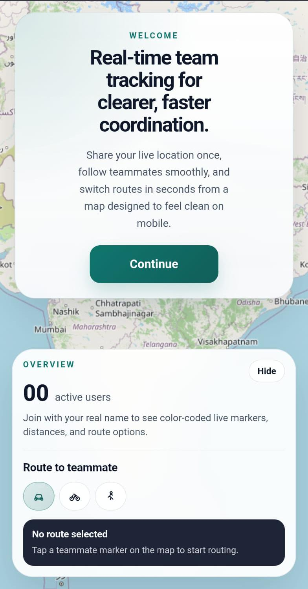
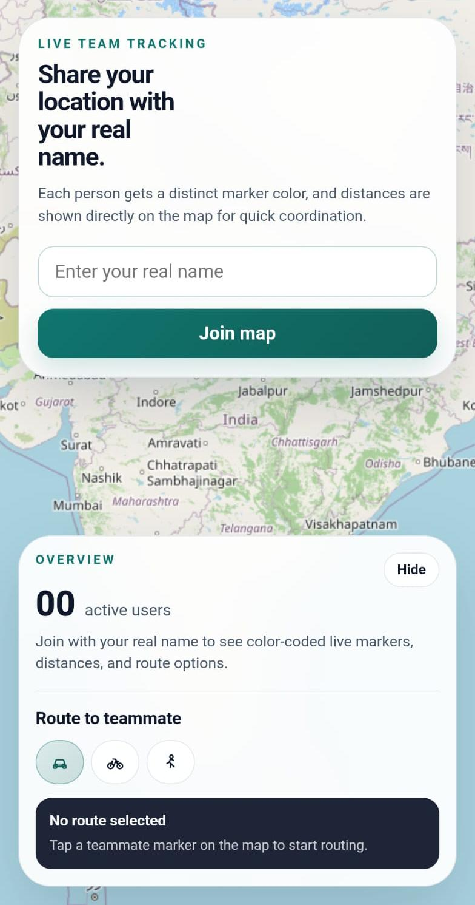
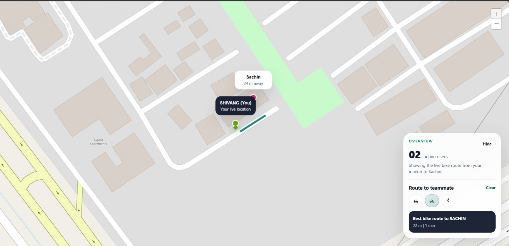
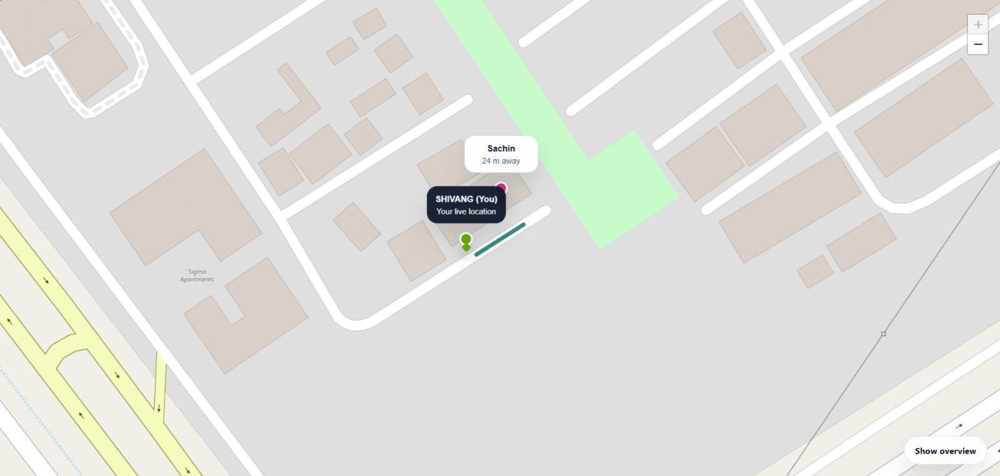

# Real-Time Tracking App

Real-Time Tracking App is a real-time location tracking web app built with Node.js, Express, Socket.IO, and Leaflet. It shows connected users on a shared map with polished live markers, real names, distinct colors, live distance updates, and route options for car, bike, and walk.

## Tech Stack

- Node.js
- Express.js
- EJS
- Socket.IO
- Leaflet.js
- OpenStreetMap tiles
- HTML, CSS, and vanilla JavaScript

## How It Works

1. The Express server renders the main page and serves static assets from the `public` folder.
2. On the first visit, the browser shows a welcome card, then asks for the user's real name once and saves it in `localStorage`.
3. On later refreshes in the same browser, the app reuses the saved name and skips the welcome and name cards.
4. Once geolocation permission is granted, the app gets the current location and starts watching for future location updates.
5. The client throttles outgoing location broadcasts to about one update every `10` seconds for steadier live movement.
6. The client sends the user's display name, latitude, longitude, and accuracy to the server through Socket.IO using the `send-location` event.
7. The server broadcasts that location to all connected clients using the `receive-location` event.
8. Each client creates or updates a custom Leaflet marker for that socket ID.
9. Marker cards show the user's real name and distance relative to your current marker.
10. Routing starts when you click another teammate's marker on the map, then switch between car, bike, and walk modes from the overview card.
11. Car, bike, and walk routes use OSRM-compatible road-routing services.
12. When a user disconnects, the server emits `user-disconnected`, and all clients remove that user's marker from the map.

## Features

- First-time welcome screen with one-time display per browser
- Real-name setup saved locally so refreshes skip the intro flow
- Real-time location updates with Socket.IO
- Shared live map using Leaflet
- Automatic marker creation and updates for connected users
- Smooth marker gliding instead of jumpy position changes
- Distinct marker color for each connected user
- Live distance labels between your marker and other users
- Travel-mode selector with compact car, bike, and walk icons
- Route overlay from your location to a selected user
- Marker-click routing workflow from the map itself
- Route summary with distance and estimated travel time
- Overview card that can be hidden and reopened on smaller screens
- Marker removal when a user disconnects
- Map auto-fit behavior to keep active users visible
- User-facing status messages for geolocation errors
- High-accuracy geolocation with jitter filtering
- Slower `10` second live broadcast cadence for calmer distance updates

## Preview

These demo screenshots show the current mobile-first onboarding flow and the live routing experience.

### Welcome Screen


### Name Entry


### Live Route View


### Collapsed Overview


## Project Structure

```text
Real-Time-Tracking-App/
|-- app.js
|-- docs/
|   |-- demo-collapsed-overview.jpeg
|   |-- demo-live-route.jpeg
|   |-- demo-name-entry.jpeg
|   `-- demo-welcome.jpeg
|-- package.json
|-- public/
|   |-- css/
|   |   `-- style.css
|   `-- js/
|       `-- script.js
`-- views/
    `-- index.ejs
```

## Installation

1. Clone the repository:

```bash
git clone <your-repository-url>
cd Real-Time-Tracking-App
```

2. Install dependencies:

```bash
npm install
```

3. Start the server:

```bash
node app.js
```

4. Open the app in your browser:

```text
http://localhost:3000
```

## Usage

1. Open the app in your browser.
2. On the first visit, read the welcome card and press `Continue`.
3. Enter your real name once and allow location permission.
4. Wait for other users to appear on the map.
5. Click a teammate marker to start routing to them.
6. Use the car, bike, and walk buttons in the overview card to switch route mode.
7. Use `Hide` if you want to collapse the overview card on a small screen.

## Live Demo

This project can be tested through an ngrok HTTPS tunnel while the local server is running.

- Start the app locally with `node app.js`
- Start ngrok with `ngrok http 3000`
- Run `npm run ngrok:url` to print the current HTTPS demo URL
- The public URL usually changes whenever ngrok is restarted

## Testing on Another Device

If you want to test the app on a phone or another laptop on the same network, you can try your local network IP:

```text
http://<your-local-ip>:3000
```

However, many mobile browsers block geolocation on plain HTTP. For reliable multi-device testing, use an HTTPS tunnel such as ngrok.

Because the app stores the welcome state and display name in browser `localStorage`, testing with multiple browsers or devices gives the most realistic multi-user behavior.

### ngrok

Start your app first:

```bash
node app.js
```

Then run ngrok against port `3000`:

```bash
ngrok http 3000
```

If ngrok is already running locally, this project also includes helper scripts:

```bash
npm run ngrok:url
npm run ngrok:tunnels
```

## Location Permission and Privacy

- The app cannot access a user's location unless the browser permission is allowed.
- If the user denies permission, the app shows a status message and does not send coordinates.
- After permission is granted, the user's live location is shared with all connected clients in the current session.
- The welcome state and saved display name are stored in browser `localStorage`.
- This project does not store location history in a database.
- This project does not include authentication, authorization, or user accounts.

If you plan to publish or deploy this project, make sure users understand that connected clients can see each other's live locations.

## Dependencies

The main runtime dependencies used in this project are:

- `express`
- `ejs`
- `socket.io`

Leaflet is loaded from a CDN in the browser.
Car, bike, and walk routing are fetched in the browser from OSRM-compatible public routing services.

## License

This project is licensed under the MIT License. See the [LICENSE](./LICENSE) file for details.

## Future Improvements

- Add authentication so only approved users can join a session
- Add rooms or private groups for location sharing
- Persist location history if needed
- Improve the UI for mobile devices
- Add user labels or avatars on markers
- Deploy the app with HTTPS by default
